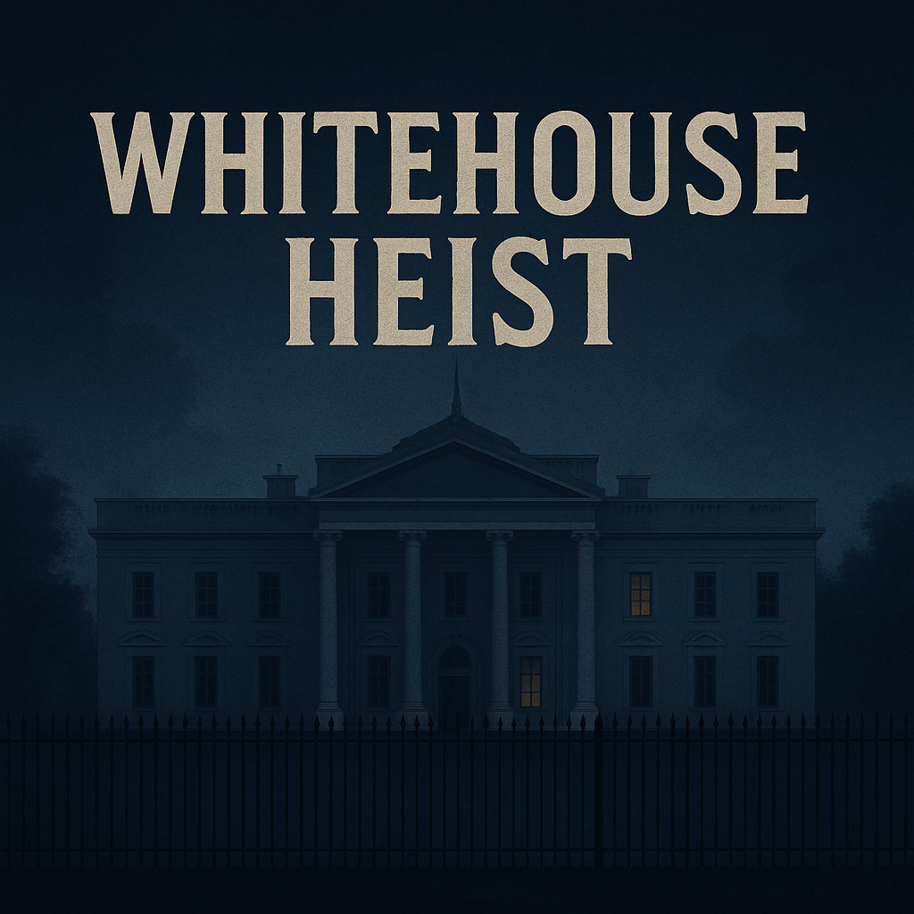
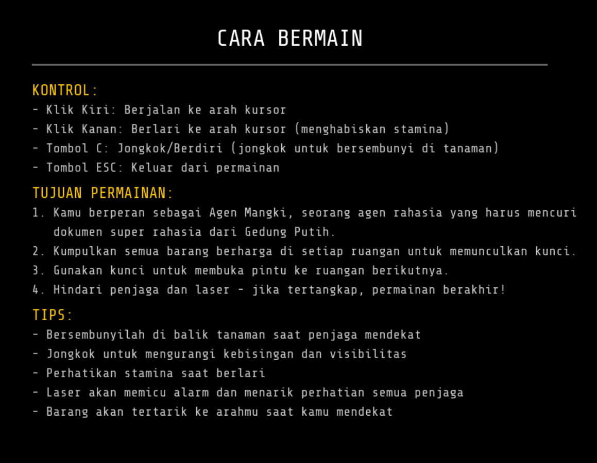
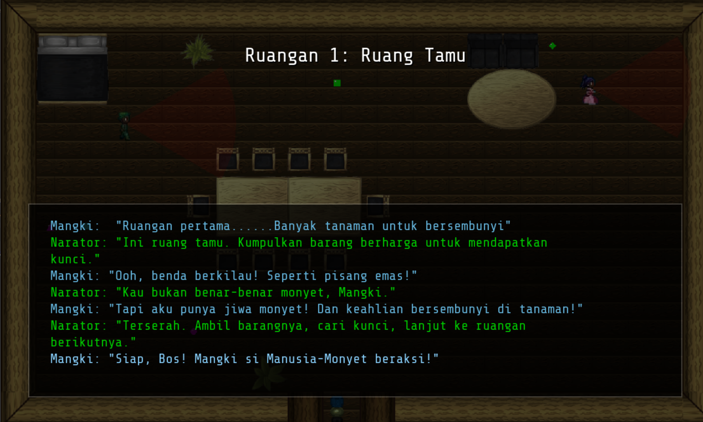
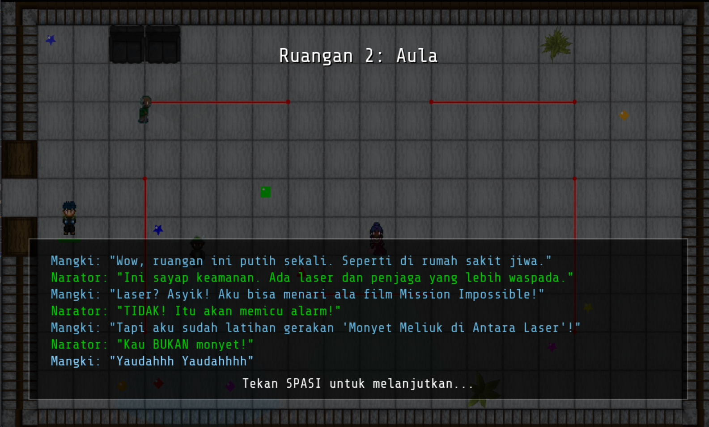
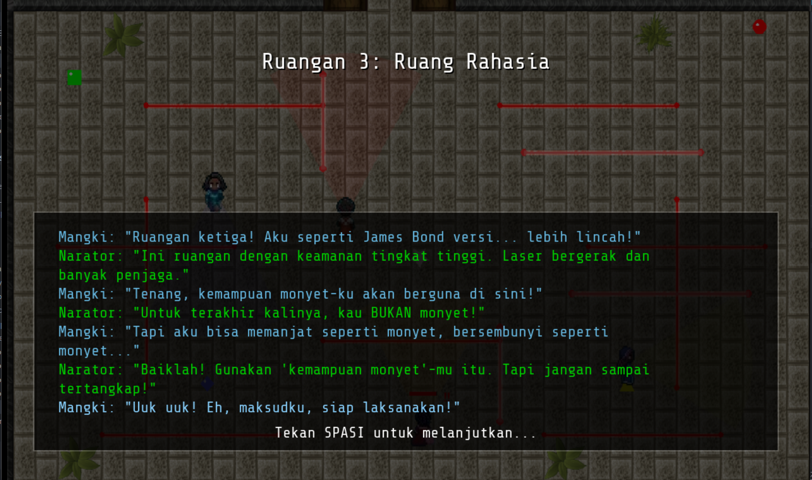
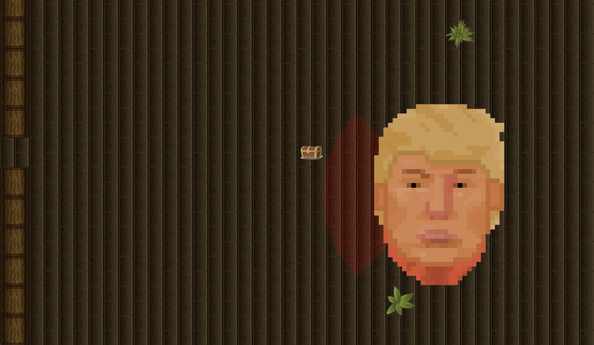
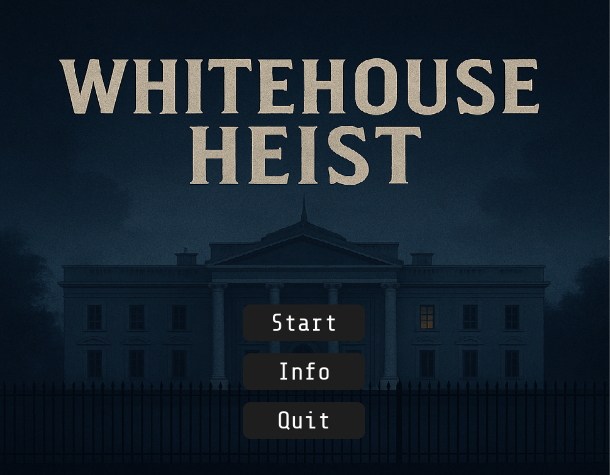
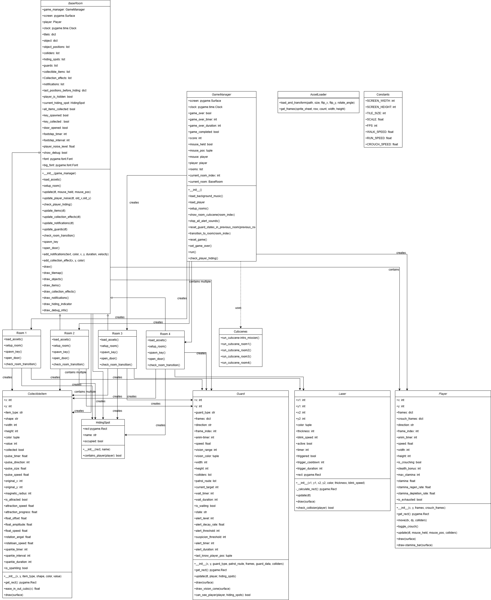

<h1 align="center">WhiteHouse Heist</h1>
<p align="center">
  
</p>


## Project Description
WhiteHouse Heist is a 2D stealth-action comedy game where players take on the role of Agent Mangki, a professional thief infiltrating the White House to steal top-secret government documents.With pixel-art visuals and a top-down perspective, WhiteHouse Heist offers a blend of action, exploration, and deep narrative, set in a mission full of intrigue at the heart of power.The name “WhiteHouse Heist” is inspired by the iconic White House in the United States, symbolizing the game’s primary location. The player’s main mission is to steal from every room while avoiding guards and traps, ultimately reaching the final room, where the main boss awaits.

## Library, Frameworks & Tools Used

- [Python 3.XX](https://www.python.org/)
- [Pygame](https://www.pygame.org/)


## How To Play



## Screenshots








## How to Run

1. Clone this repository  
    ```bash
    git clone https://github.com/eltoruz/whitehouse-heist.git
    ```

2. Change directory to the project folder
    ```bash
    cd whitehouse-heist
    ```

3. Install pygame
    ```bash
    pip install pygame numpy 
    ```

4. Run the game
    ```bash
    python main.py
    # or
    python3 main.py
    ```

## UML Class Diagram



## Contributors

| Name                           | NIM         |
|--------------------------      |-------------|
| Ebentua Philippus Limbong      | 123140086   | 
| Rifael Eurico Sitorus          | 123140077   | 
| Nabila Yuliana                 | 12314  | 
| Aditya Ronal Maruli            | 12314   | 
| Riyan Sandi Prayoga            | 12314   | 


## Reference
- [Design Patterns and Video Games](https://www.patternsgameprog.com/series/discover-python-and-patterns/)
- [PyGame Tutorial: Centralized Scene Logic](https://nerdparadise.com/programming/pygame/part7)
- [pygame.org - TUT_DESIGN](https://www.pygame.org/wiki/tut_design)
- [PyGame: A Primer on Game Programming in Python](https://realpython.com/pygame-a-primer/)

Game Reference :
- [Robbery Bob]

#### Note
<i>This game is still under heavy development. Some features, content, and documentation may be added in later versions. Feedback from others is greatly appreciated to improve the gaming experience.</i>

